# 摄像头支架

[English](README.md) | 简体中文

本仓库汇总 B601 机械臂及数据采集场景使用的摄像头支架 CAD 文件，并提供一个 USDZ 格式的环境模型。

## 资源目录

| 分类 | 内容 | 格式 |
| --- | --- | --- |
| [B601 摄像头支架](#b601-摄像头支架) | 4 款摄像头支架 | STEP（`.step`） |
| [数据采集摄像头支架](#数据采集摄像头支架) | V1：4 款支架主体及 4 个适配件；V2：1 个完整装配 | STEP（`.stp`） |
| [数据采集环境](#数据采集环境) | 1 个箱体模型 | USDZ（`.usdz`） |

以下介绍覆盖仓库内全部 14 个模型文件。摄像头及机械臂名称沿用上游文件中的命名；上游未提供完整尺寸说明、紧固件清单、打印参数或适配验证结果。制作前请打开 CAD 文件，结合实际设备检查安装尺寸和间隙。

## B601 摄像头支架

这些文件来自 [reBot-DevArm 的 B601-DM 3D 打印零件目录](https://github.com/Seeed-Projects/reBot-DevArm/tree/main/hardware/reBot_B601_DM/3D_Printed_Parts)。

### D405 / 305 支架

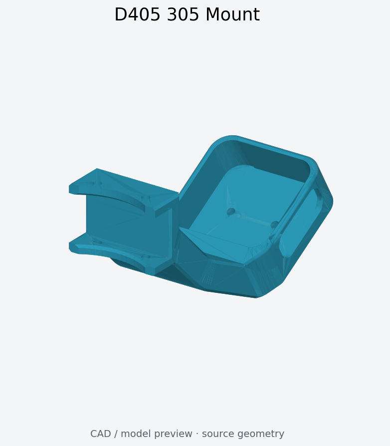

*根据本仓库的 STEP 文件生成的模型预览。*

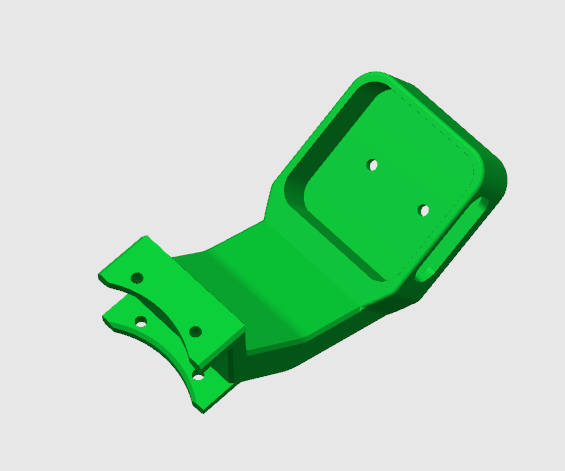

[下载 D405_305_Mount.step](b601-camera-mounts/D405_305_Mount.step)

文件名标识为 D405 / 305 支架。模型由摄像头承载板和弧形安装底座组成，承载板上有安装孔。上游未说明名称中“305”的具体含义。上图均为 CAD 渲染图。

### D435 / Gemini 2 支架

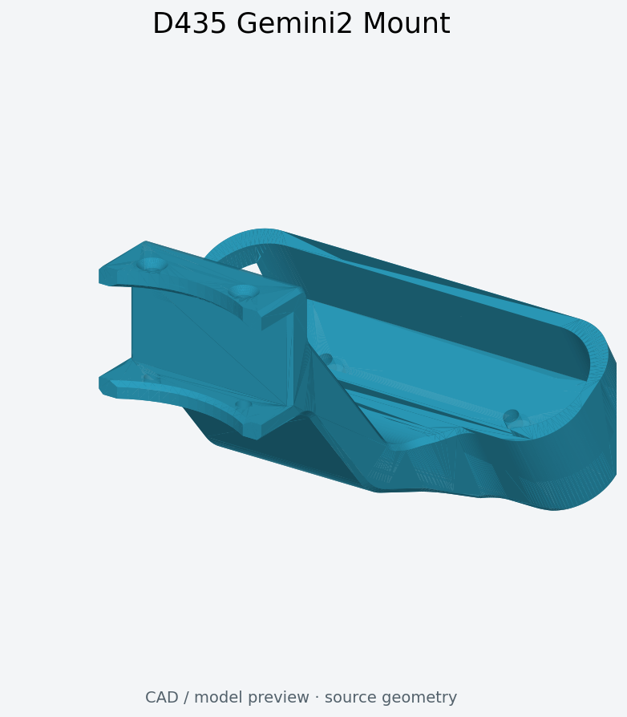

*根据本仓库的 STEP 文件生成的模型预览。*

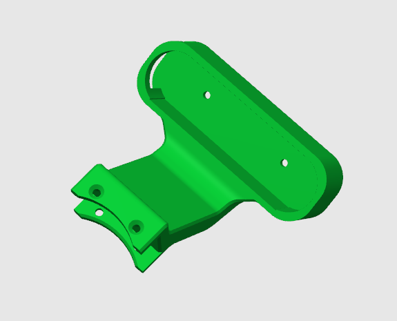

[下载 D435_Gemini2_Mount.step](b601-camera-mounts/D435_Gemini2_Mount.step)

文件名标识为 D435 / Gemini 2 支架。模型具有长条形摄像头承载板和弧形安装底座。上游参考图名为 D435i，仅作为外形参考；各型号的实际安装适配情况仍需检查。

### D455f 支架

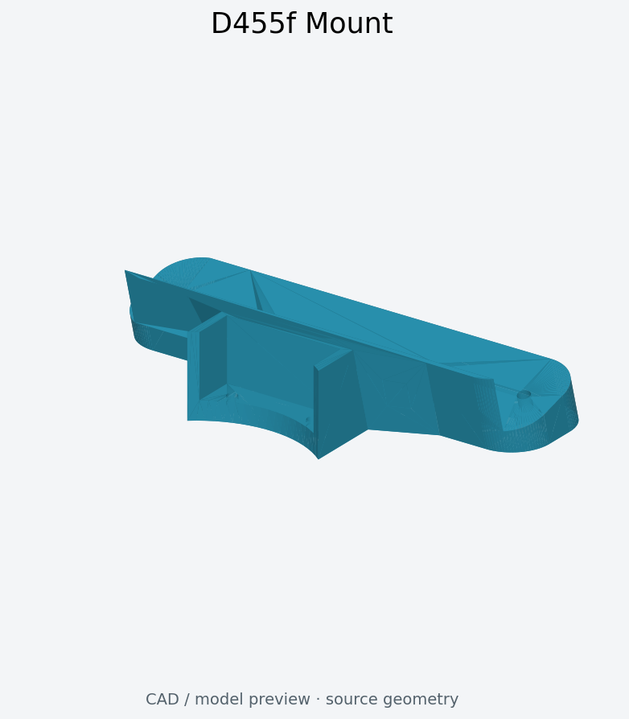

*根据本仓库的 STEP 文件生成的模型预览。*

[下载 D455f_Mount.step](b601-camera-mounts/D455f_Mount.step)

文件名标识为 D455f 支架。模型为带安装孔的长条形支撑结构，下方有加强部分。可打开 STEP 文件检查安装孔位置和连接结构。

### UVC32 支架

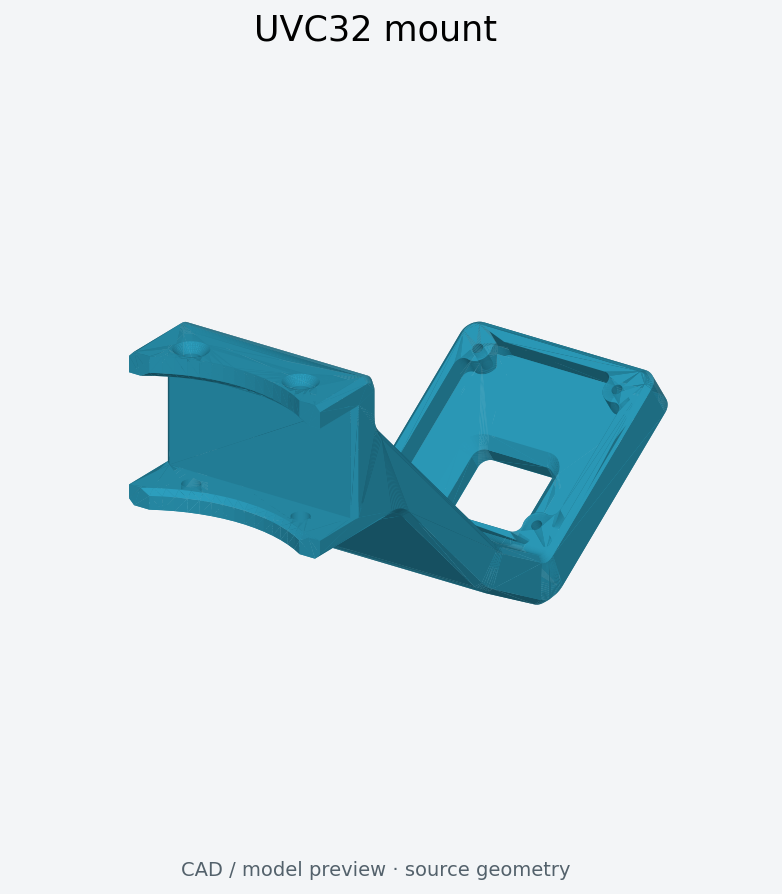

*根据本仓库的 STEP 文件生成的模型预览。*

[下载 UVC32_mount.step](b601-camera-mounts/UVC32_mount.step)

文件名标识为 UVC32 支架。摄像头安装板带矩形开口，并连接到弧形安装底座。可打开 STEP 文件检查开口、安装孔及底座尺寸。

## 数据采集摄像头支架

数据采集摄像头支架分为两个结构版本：

| 版本 | 结构 | 文件 |
| --- | --- | --- |
| [V1](data-collection-camera-mounts/V1/) | 3D 打印支架主体及摄像头适配件 | 下方的 4 款编号支架和 4 个适配件 |
| [V2](#v2铝型材摄像头支架) | 铝型材主体＋3D 打印摄像头支架 | 1 个完整 STEP 装配 |

V1 来自上游 [Camera-Mount 仓库](https://github.com/xiehuangbao888/Camera-Mount)，提供 4 款编号支架和 4 个对应的适配件，配件对应关系按原始文件名保留。上游没有提供装配说明或实物照片，完整装配效果及摄像头适配情况尚未验证。V2 由本仓库维护者提供，主体改用铝型材。

### 支架 1

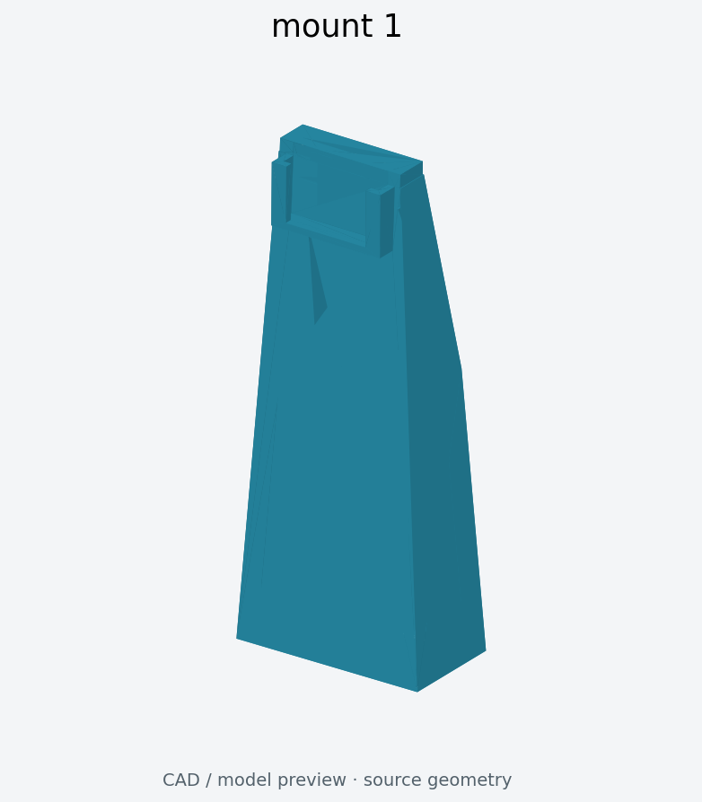

*支架 1 主体。*

[下载 mount-1.stp](data-collection-camera-mounts/V1/mount-1.stp)

主体为较高的渐缩支撑结构，上端设有阶梯状连接接口。配套提供两个独立适配件，可根据实际机械臂选择，并在 CAD 软件中检查连接关系。

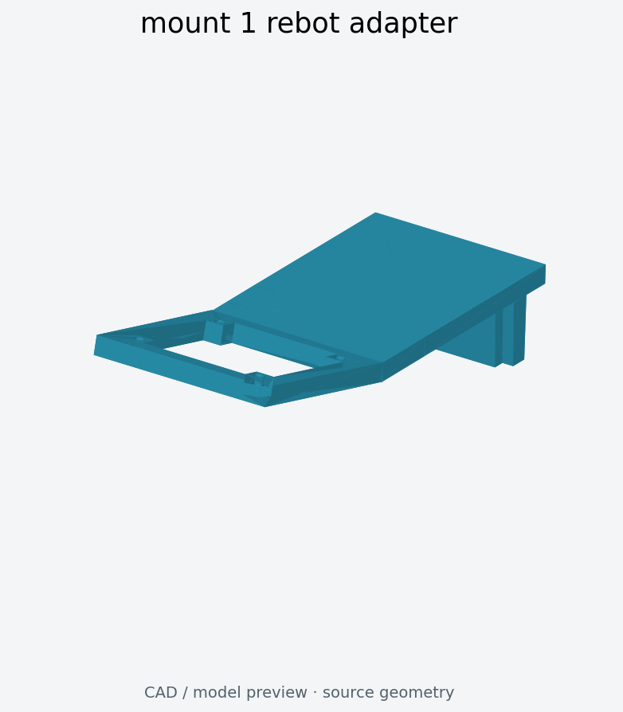

[下载 reBot 适配件](data-collection-camera-mounts/V1/mount-1-rebot-adapter.stp)

reBot 适配件为带开口和偏置连接部分的板状零件，对应上游的“支架1插件rebot”。

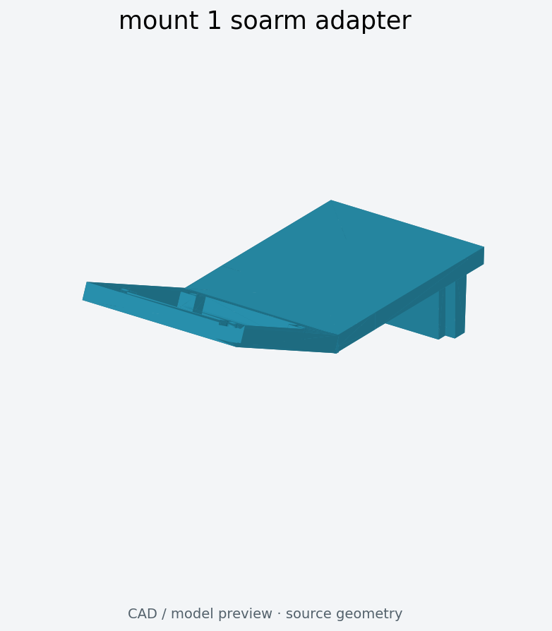

[下载 SO-ARM 适配件](data-collection-camera-mounts/V1/mount-1-soarm-adapter.stp)

SO-ARM 适配件为偏置板状零件，对应上游的“支架1插件soarm”。以上图片分别展示主体和配件，未进行装配验证。

### 支架 2

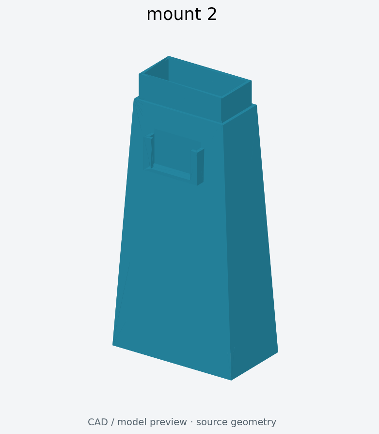

[下载 mount-2.stp](data-collection-camera-mounts/V1/mount-2.stp)

主体为渐缩支撑结构，上端连接接口与支架 1 不同。配套提供一个 SO-ARM 适配件。

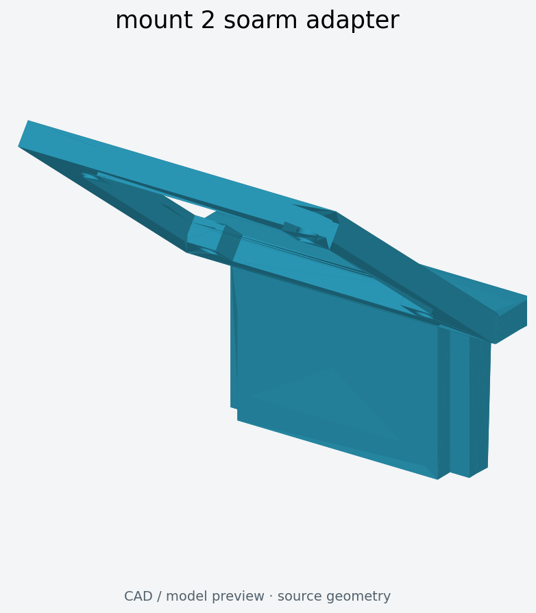

[下载 SO-ARM 适配件](data-collection-camera-mounts/V1/mount-2-soarm-adapter.stp)

此配件对应上游的“支架2插件soarm”。请同时打开主体和适配件模型，检查连接方式及间隙。

### 支架 3

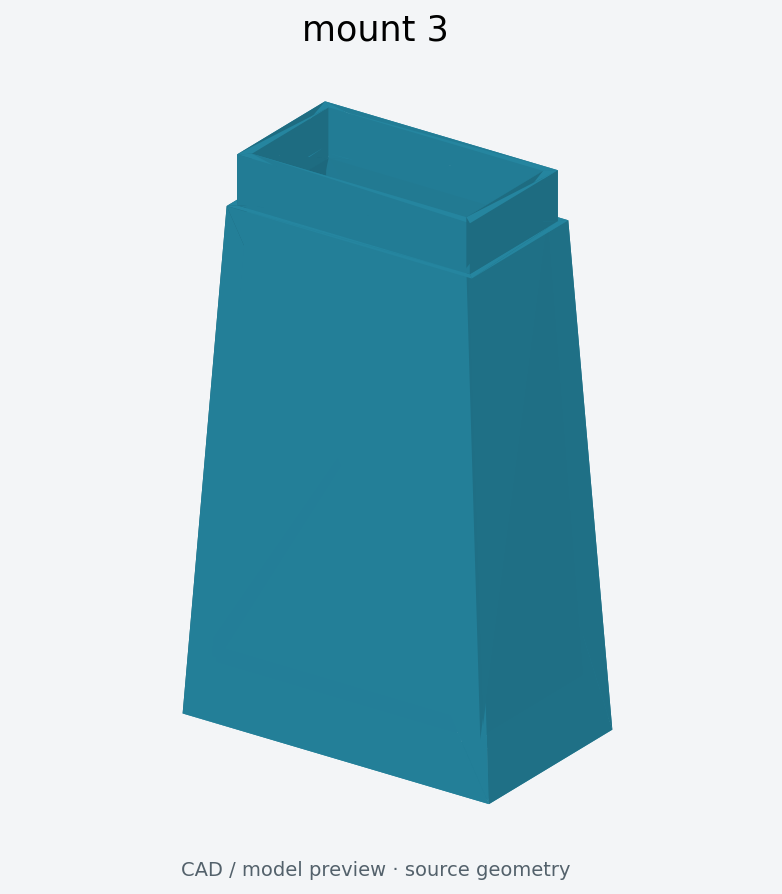

[下载 mount-3.stp](data-collection-camera-mounts/V1/mount-3.stp)

主体为渐缩支撑结构，顶部具有矩形凸起部分。根据上游文件名，支架 3 和支架 4 使用同一个适配件。

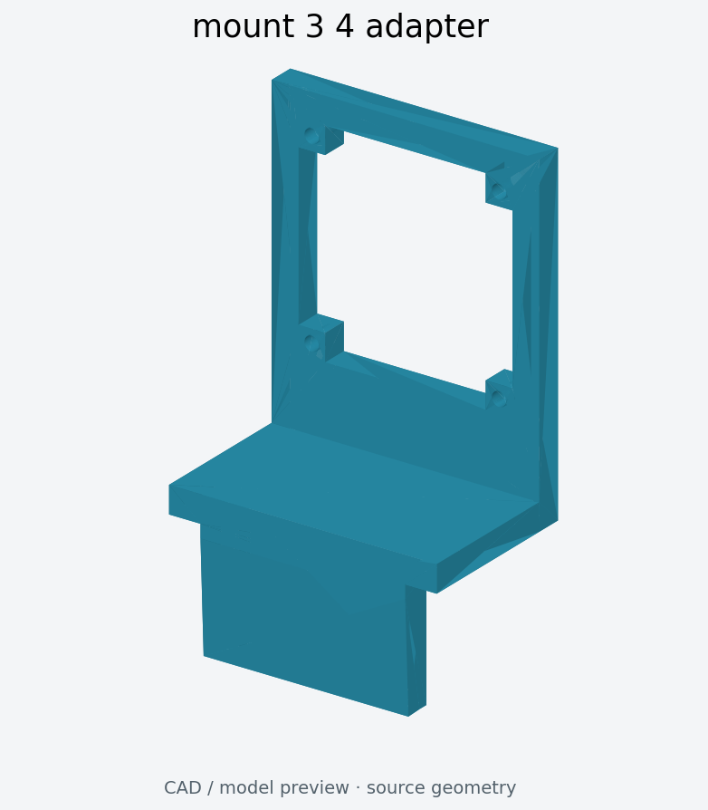

[下载支架 3 / 4 共用适配件](data-collection-camera-mounts/V1/mount-3-4-adapter.stp)

此配件对应上游的“支架3_4插件”。图片分别展示支架主体及共用配件。

### 支架 4

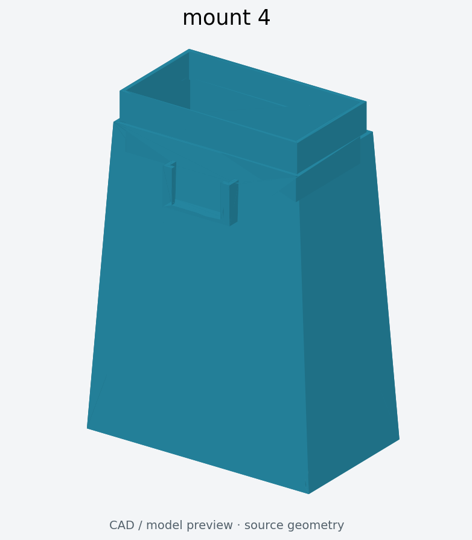

[下载 mount-4.stp](data-collection-camera-mounts/V1/mount-4.stp)

主体为渐缩支撑结构，顶部具有较宽的内凹接口。对应配件为上述[支架 3 / 4 共用适配件](data-collection-camera-mounts/V1/mount-3-4-adapter.stp)。选择前可在 CAD 软件中比较支架 3 和支架 4 的接口几何。

### V2：铝型材摄像头支架

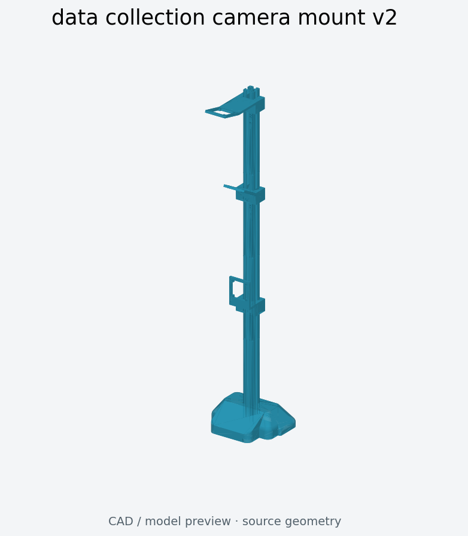

*根据提供的 STEP 几何生成的完整装配预览。*

[下载 data-collection-camera-mount-v2.stp](data-collection-camera-mounts/data-collection-camera-mount-v2.stp)

V2 为铝型材主体＋3D 打印摄像头支架的数据采集支架；V1 使用 3D 打印主体。新文件包含主体和摄像头安装部件的完整装配，是装配 CAD 文件，并非可直接打印的一组 STL。制作前请在 CAD 软件中识别需要打印的部件，并检查摄像头安装接口。

### 中英文文件名对照

仅修改文件名，CAD 文件内容保持不变；V1 支架编号和配件对应关系均保留，V2 装配由维护者本地提供。

| 原始文件名 | 英文文件名 |
| --- | --- |
| `数据采集摄像头支架_支架1.stp` | [`mount-1.stp`](data-collection-camera-mounts/V1/mount-1.stp) |
| `数据采集摄像头支架_支架1插件rebot.stp` | [`mount-1-rebot-adapter.stp`](data-collection-camera-mounts/V1/mount-1-rebot-adapter.stp) |
| `数据采集摄像头支架_支架1插件soarm.stp` | [`mount-1-soarm-adapter.stp`](data-collection-camera-mounts/V1/mount-1-soarm-adapter.stp) |
| `数据采集摄像头支架_支架2.stp` | [`mount-2.stp`](data-collection-camera-mounts/V1/mount-2.stp) |
| `数据采集摄像头支架_支架2插件soarm.stp` | [`mount-2-soarm-adapter.stp`](data-collection-camera-mounts/V1/mount-2-soarm-adapter.stp) |
| `数据采集摄像头支架_支架3.stp` | [`mount-3.stp`](data-collection-camera-mounts/V1/mount-3.stp) |
| `数据采集摄像头支架_支架3_4插件.stp` | [`mount-3-4-adapter.stp`](data-collection-camera-mounts/V1/mount-3-4-adapter.stp) |
| `数据采集摄像头支架_支架4.stp` | [`mount-4.stp`](data-collection-camera-mounts/V1/mount-4.stp) |
| `数据采集摄像头支架.stp`（V2，维护者提供） | [`data-collection-camera-mount-v2.stp`](data-collection-camera-mounts/data-collection-camera-mount-v2.stp) |

## 数据采集环境

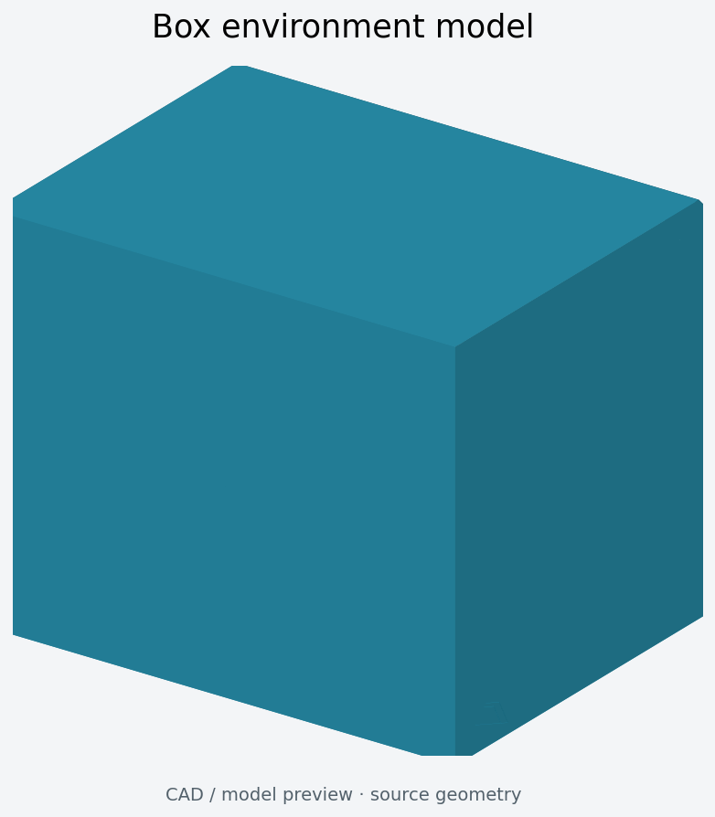

*根据 USDZ 文件中的网格几何生成的模型预览。*

[下载 box.usdz](data-collection-environment/box.usdz)

箱体模型来自 [rebot-arm-dli-isaacsim](https://github.com/yuyoujiang/rebot-arm-dli-isaacsim)，用于数据采集环境。此资源为环境模型，可在支持 USDZ 的软件中查看结构；仓库未提供实物制作照片。

## 文件使用方法

1. 通过上述链接下载所需支架及对应适配件。
2. 在 CAD 软件中打开 STEP/STP 文件，检查尺寸、安装孔和装配间隙。
3. 根据实际加工方式准备制作文件。仓库未提供 STL 文件、打印参数或紧固件清单。
4. 使用支持 USDZ 的查看器或工具打开环境模型。

## 图片来源与模型预览

全部 14 个模型文件均有直接根据原始 STEP 或 USDZ 几何生成的预览图。这些图片是模型预览，并非实物照片。V1 适配件单独展示，图片不代表已完成装配或适配验证。

另外两张 B601 参考图来自上游：[D405.jpg](https://github.com/Seeed-Projects/reBot-DevArm/blob/main/hardware/reBot_B601_DM/3D_Printed_Parts/images/D405.jpg) 和 [D435i.jpg](https://github.com/Seeed-Projects/reBot-DevArm/blob/main/hardware/reBot_B601_DM/3D_Printed_Parts/images/D435i.jpg)，两者也均为 CAD 渲染图。

如需重新生成预览图，在 Python 环境中安装 `cadquery`、`matplotlib`、`numpy` 和 `usd-core`，然后在仓库根目录执行 `python tools/render_previews.py`。仅生成 V2 预览可执行 `python tools/render_previews.py data-collection-camera-mounts/data-collection-camera-mount-v2.stp`。

## 资源来源与许可

- B601 摄像头支架及参考渲染图：[Seeed-Projects/reBot-DevArm](https://github.com/Seeed-Projects/reBot-DevArm)，许可为 CERN OHL-W-2.0。
- V2 数据采集摄像头支架：由本仓库维护者本地提供，详见 [NOTICE.md](NOTICE.md)。
- V1 数据采集摄像头支架：[xiehuangbao888/Camera-Mount](https://github.com/xiehuangbao888/Camera-Mount)。复制这些资源时，上游仓库未声明许可证。
- 数据采集环境：[yuyoujiang/rebot-arm-dli-isaacsim](https://github.com/yuyoujiang/rebot-arm-dli-isaacsim)，许可为 MIT。

详情请查看 [NOTICE.md](NOTICE.md)、[LICENSE](LICENSE) 和 [licenses/](licenses/)。
